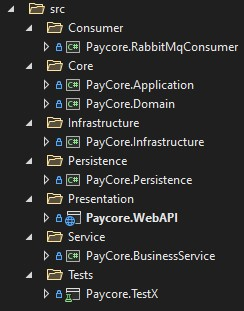
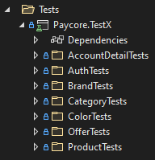

# PayCore & Patika.dev .Net Core Bootcamp 

## Bitirme Projesi
Bu proje temel olarak iki ana projenin birleşmesinden oluşmaktadır. 
Bunlar;
* WebAPI
* Consumer

# İçindekiler 
  * [1.Proje Çalıştırılması](#proje-run)
  * [2.Domain](#domain)
  * [3.Application](#application)
  * [4.Infrastructure](#infrastructure)
  * [5.Persistence](#persistence)
  * [6.Service](#service)
  * [7.WebAPI](#webapi)
  * [8.Consumer](#consumer)
  * [9.Unit Test](#unittest)
  * [10.Controllers](#controller) 

Bu projede [Onion Architecture](https://www.gencayyildiz.com/blog/nedir-bu-onion-architecture-tam-teferruatli-inceleyelim/) 
katmanlı mimarisi kullanıldı. Bu mimari temel olarak dört kısımdan oluşmaktadır.
Projenin klasör yapılanması aşağıdaki gibidir. 

## Proje Çalıştırılması

Projeyi çalıştırmak için Multiple Startup'ı seçmemiz gerekiyor Solution Properties'lerinden.
Burada WebAPI,Consumer sırası ile start verilmelidir.

Projeye start verilmelidir. Kullanıcı arayüzünde işlemler yapabilmesi için kullanıcının login
olması gerekmektedir. Register olunabilir daha sonra tekrardan login olması gerekir. Token alabilmesi için 
register olan kullanıcının login işlemini gerçekleştirmesi gerekmektedir.

Controller'lara istek atılabilmesi için login olunması gerekmektedir.

## Domain

Uygulamamızın database tablolarına karşılık gelen classları oluşturduğumuz katmandır.
Nhibernate code-first yaklaşımı kullanılmıştır. Class'ları yani Entity'leri 
oluşturup daha sonra database kısmına aktarılmıştır. 

**Domain Class Library**

## Application
Bu katman da soyutlama işlemleri yapılmaktadır. Uygulamanın geneline hitap edecek tüm nesneler 
bu katmanda tanımlanır. Burada tanımlı olan interfaceler diğer katmanlarda somut nesnelere dönüşmektedir.

**Application Class Library**

*Interfaces* : Soyutlama işlemlerini yaptığımız kısımdır.  
*Utilities*  : Base yapıların olduğu ve projenin genelinde kullandığımız nesnelerdir.
*Models* : Entitylerimizi kullanıcıya gereksiz kısımları göstermemek için oluşturduğumuz ara nesnelerdir.  
*DependencyContainers* : Application katmanının bağımlılık çözümleyici kısmıdır. WebAPI ye eklenmesi gerekir.

## Infrastructure
Database'e erişimi olan tek katmandır. Database erişim bu katman üzerinden sağlanır. 
Application katmanında tanımladığımız soyut kavramlar(Interfaces) bu katman da 
karşılıkları oluşturularak database işlemleri yapılır.

*Mapping* : Database de ki tablolarımızın nasıl oluşacağını belirlediğimiz nesnelerdir. Burada belirlediğimiz ayarlar ile database tablolarımız oluşur.  
*DependencyContainers* : Infrastructure katmanının bağımlılık çözümleyici kısmıdır. WebAPI ye eklenmesi gerekir.  
*Sessions* : Application katmanın da ki modellere özgü Interface'lerin karşılıklarının olduğu kısımdır. 
*UnitOfWork* : [Unit Of Work](https://www.c-sharpcorner.com/UploadFile/b1df45/unit-of-work-in-repository-pattern/#:~:text=Unit%20of%20Work%20is%20the,update%2Fdelete%20and%20so%20on.) design pattern, Session nesnelerinin tek bir yerden 
yönetilebilmesini sağlamak amacıyla kullanılmıştır.

## Persistence
Sisteme eklenecek dış/external yapılanmalar bu katmanda dahil edilir. 

*DependencyContainers* : Infrastructure katmanının bağımlılık çözümleyici kısmıdır. WebAPI ye eklenmesi gerekir.  
*Services* Dışa bağımlılık kuracağımız service'ler burada tanımlanır. 
RabbitMQ kuyruk yapısı ve mail servis tanımlanmıştır.

## Service 
Uygulamanın iş mantığını kurguladığımız katmandır. Bu katmanda iş kurallarımıza bağlı olarak 
servicelerimizi yapılandırırız.

*Cache* : Cacheleme işlemlerini kontrol ettiğimiz service'dir.
*DependencyContainers* : Service katmanının bağımlılık çözümleyici kısmıdır.
*HelperServices* : Database'e bağımlı olmayan projede diğer service'lere inject edilerek kullanılan servicelerdir.
*Services* : Entitylerimizin database ile ilişkilerinin iş mantığı kuralları çerçevesinde gerçekleştirilmesini sağlayan servicelerdir.

## WebAPI
Uygulamamıza gelen kullanıcının isteklerini karşıladığımız ve bunlara gerekli cevabı 
döndüğümüz arayüzdür. WebAPI sunum katmanının içerisinde yer alır. WebAPI'yi istenilen başka her
hangi bir uygulamaya da servis edebiliriz.

*Controller*  : Yapılan isteğin türüne göre HTTP verblerinden(Get,Put,Delete,Post) uygun olan fonksiyonun içeriği çalışacaktır. 
Çalışan bu kısım istekte bulunan clienta(isteği atan) response döndürecektir.  
*Middlewares* : Custom Excepstion Middleware yazılmıştır. Request gelip response dönene kadar 
herhangi bir hata olması durumunda hata loglanacak ve de kullanıcı kısmına daha okunabilir hata yansıtmamızı sağlayacaktır.

## Consumer
Console uygulamasıdır. RabbitMQ service'nin kuyruğa eklenen emailleri okuyup gönderilmesi 
gereken mail adresine gönderme işlemini yapmaktadır.

## Unit Test 

Unit Test, bir sistemde mantıksal olarak izole edilebilecek en küçük kod parçası olan bir birimi test etmenin bir yoludur.
Bütün methodlara unit test yazılmıştır.

# Controllers

**AuthController**

Kullanıcı login ve register işlemlerini yapabilmektedir.

**AccountDetails** 

Kullanıcı kendi ürünlerine gelen teklifleri listeleyebilir(GetUserProductOffers()).
Ayrıca teklif yaptığı ürünleri de listeleyebilir(GetUserOffersOnProducts()).

**ProductsController** 

Ürün ekleme, güncelleme, silme, listeleme ve ürün satma apileri bulunmaktadır. 

**OffersController**

Teklif verme, güncelleme, silme, listeleme, teklif onaylama ve teklifi reddetme işlemleri yapılabilmektedir.

**CategoriesController**

Kategori ekleme, güncelleme, silme ve listeleme işlemleri yapılabilmektedir.

**BrandsController**

Marka ekleme, güncelleme, silme ve listeleme işlemleri yapılabilmektedir.

**ColorsController**

Renk ekleme, güncelleme, silme ve listeleme işlemleri yapılabilmektedir.

